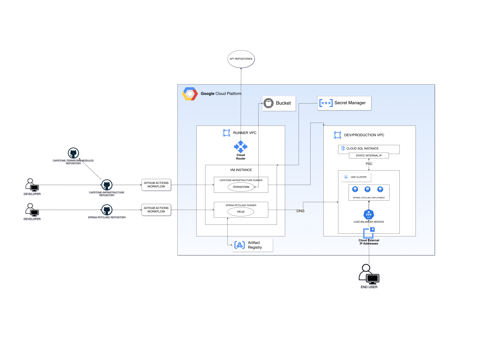

# Capstone Infrastructure

This repository is a part of the `Internship: DevOps` Capstone Project. Here, you can find the code for:
* Self-Hosted GitHub Actions Runner 
* Dev/Production Environments
* Create/Destroy Runner Workflows
* Plan/Create/Destroy Infrastructure Workflows
* Architecture Diagram

For more details, visit:
* [Capstone Terraform Modules Repository](https://github.com/dejanakop/capstone-terraform-modules)
* [Spring-Petclinic App Repository](https://github.com/dejanakop/spring-petclinic)

## Architecture Diagram
